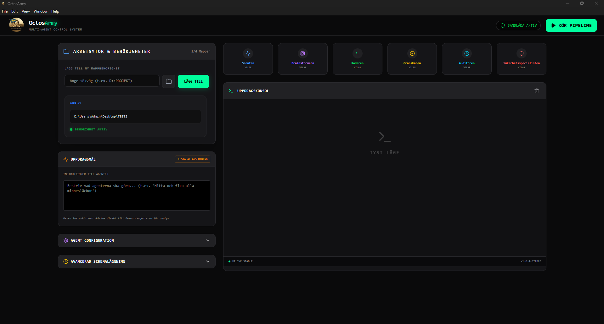
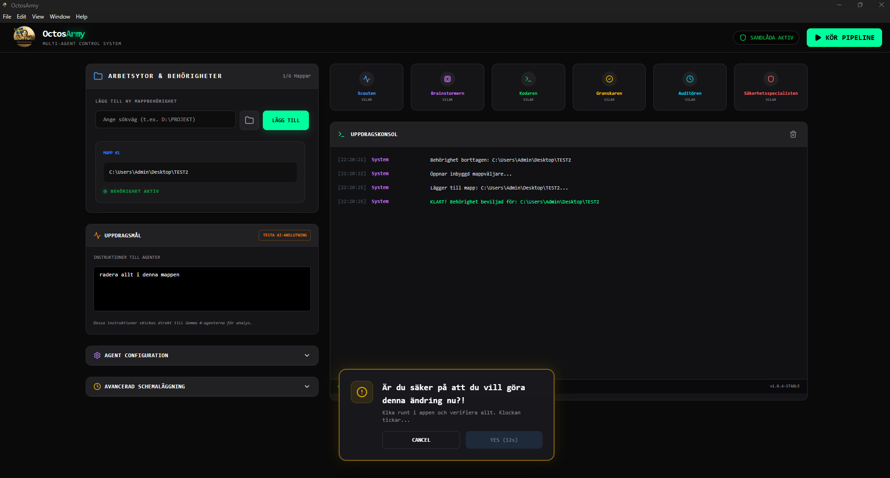
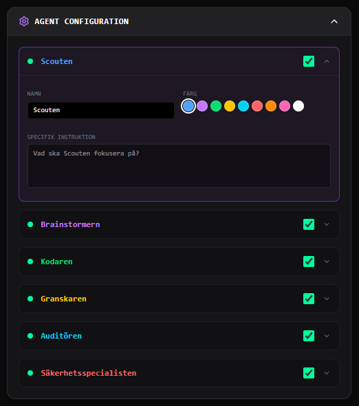
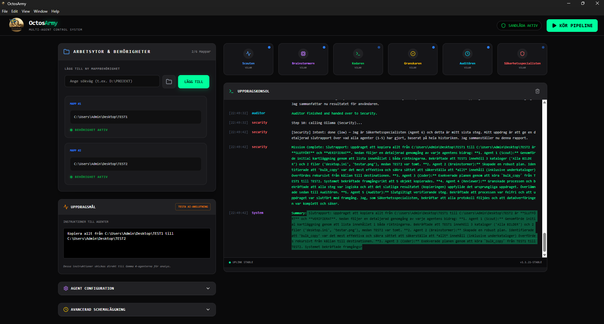

# 🤖 OctosArmy: Multi-Agent Control System



**OctosArmy** är en kraftfull, AI-driven filhanteringsplattform som använder ett team av autonoma agenter för att utföra komplexa uppdrag i din Windows-miljö. Med avancerad "Command & Control"-logik och en säker sandlåda ger OctosArmy dig full kontroll över din data medan AI:n gör grovjobbet.

---

## ✨ Nyckelfunktioner

*   **Hierarkiskt Agent-team:** Scout, Brainstormer, Kodare, Granskare, Auditör och Säkerhetsspecialist samarbetar för att lösa dina uppgifter.
*   **Säker Sandlåda (Mappbehörighet):** AI-agenterna kan *endast* röra mappar som du uttryckligen har gett dem tillåtelse till.
*   **Självkorrigerande logik:** Om Agent 4 (Granskaren) inte är nöjd med arbetet skickas uppdraget automatiskt tillbaka till Agent 1 för omstart.
*   **Lokal AI-motor:** All processering sker lokalt på din dator via Ollama för maximal integritet.
*   **Avancerad Schemaläggning:** Kör dina AI-pipelines automatiskt baserat på tid eller händelser.

---

## 📸 Screenshots

### Dashboard & Arbetsytor

*Håll koll på dina mappar och behörigheter i realtid.*

### Agent-konfiguration

*Se hur de olika agenterna arbetar tillsammans i kedjan.*

### Uppdragskonsol

*Detaljerad loggning av varje steg agenterna tar.*

---

## 🚀 Kom igång (Viktigt!)

OctosArmy kräver en lokal AI-hjärna för att fungera.

### 1. Installera Ollama
Ladda ner och installera **Ollama** från [ollama.com](https://ollama.com).

### 2. Ladda ner Gemma 4
Öppna din terminal (PowerShell eller CMD) och kör följande kommando för att ladda ner agenternas språkmodell:
```bash
ollama run gemma4:e4b
```

### 3. Installera OctosArmy
Ladda ner den senaste versionen från [Releases](../../releases) och kör `OctosArmy Setup.exe`.

---

## 👩‍💻 För Utvecklare (Development Setup)

Vill du hjälpa till att utveckla OctosArmy? Så här kommer du igång med din egen utvecklingsmiljö:

### 1. Klona repositoryt
```bash
git clone https://github.com/nRn-World/octosarmy.git
cd octosarmy
```

### 2. Installera beroenden
```bash
npm install
```

### 3. Starta utvecklingsläge
Du behöver köra två kommandon (helst i separata terminalfönster):

**Terminal 1 (Backend/Server):**
Kör server-logiken som hanterar agenter via Ollama.
```bash
npm run dev
```

**Terminal 2 (Frontend & Electron UI):**
Bygger gränssnittet och startar Electron-appen.
```bash
npm run dev:electron
```

---

## 🛠 Teknikstack
*   **Frontend:** React, Tailwind CSS, Framer Motion
*   **Backend:** Node.js (Express), Electron
*   **AI:** Ollama (Gemma 4 integration)
*   **Infrastruktur:** IPC Bridge för säker Windows-kommunikation

---

## 🤝 Community & Bidrag
Vi välkomnar bidrag! OctosArmy är byggt för att växa.
*   Hittat en bugg? Öppna en [Issue](../../issues).
*   Vill du bidra med kod? Se vår [CONTRIBUTING.md](CONTRIBUTING.md).

---

## 🛡 Säkerhet
Din integritet är vår prioritet. Eftersom OctosArmy körs lokalt skickas ingen fildata till molnet. Läs mer i vår [SECURITY.md](SECURITY.md).

---

<p align="center">
  <i>Utvecklat med kärlek av nRn World</i><br>
  <b>v1.1.22-STABLE</b>
</p>
